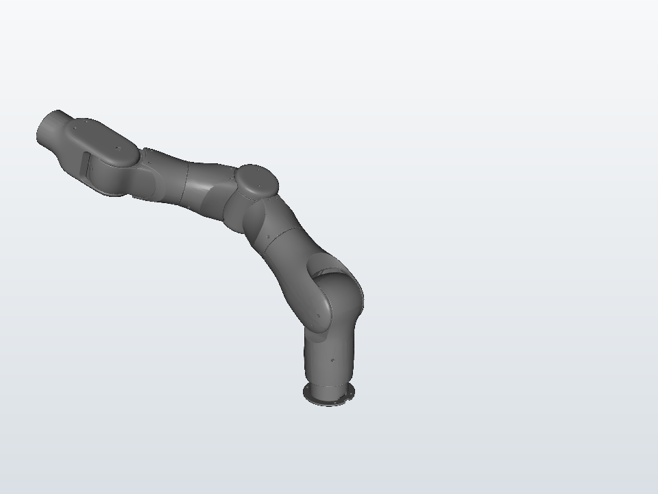

# OneRobotics A1 for mjlab



This is the **official OneRobotics A1 integration for mjlab**. It is an
independent OneRobotics project that uses
[`mujocolab/mjlab`](https://github.com/mujocolab/mjlab) as a package dependency,
following the external-project approach recommended by the mjlab maintainers.
It does not add the A1 to mjlab core.

OneRobotics develops the **OneRobotics A1**, a 7-DoF fixed-base robotic arm.
Company information is available at <http://www.onerobot.com/>.

## Overview

The project packages the canonical position-controlled right-arm MuJoCo MJCF,
its eight STL meshes, an mjlab `EntityCfg`, and an end-effector pose-reaching
task. The task samples valid joint configurations and uses native MuJoCo
forward kinematics to produce targets that are reachable by construction in
both position and orientation.

## Features

- Canonical OneRobotics A1 7-DoF right-arm MJCF and meshes
- Existing seven XML position actuators with validated gains and limits
- Portable mjlab `EntityCfg` independent of a source checkout
- Registered `Mjlab-Reach-OneRobotics-A1` task
- 7-dimensional joint-position action space
- 0.1 rad/step position-target rate limit for robust CPU/GPU execution
- Closed-loop position and orientation observations
- Multiplicative multi-scale pose reward
- RSL-RL PPO baseline and standard mjlab `train`/`play` commands
- CPU/GPU simulation, model-fidelity, package, and isolated-install tests
- Explicit Apache-2.0 code and CC BY 4.0 model-asset licensing

## Quick Start

```bash
git clone https://github.com/T1Amoo/onerobotics-a1-mjlab.git
cd onerobotics-a1-mjlab
uv sync
uv run play Mjlab-Reach-OneRobotics-A1 --agent zero
```

Use `--agent random` to exercise random joint actions:

```bash
uv run play Mjlab-Reach-OneRobotics-A1 --agent random
```

## Installation

The project supports the same Python range as mjlab 1.6: Python 3.10 through
3.13. `uv` installs `mjlab>=1.6.0,<2.0.0` from the normal package index; there
is no sibling checkout, file URL, or editable mjlab dependency.

```bash
uv sync
uv run list-envs | grep Mjlab-Reach-OneRobotics-A1
```

## Available Tasks

| Task ID | Robot | Description |
| --- | --- | --- |
| `Mjlab-Reach-OneRobotics-A1` | OneRobotics A1 | Reach a jointly reachable end-effector pose |

The single task registration provides separate training and play configs via
mjlab's `env_cfg`, `play_env_cfg`, and `rl_cfg` registry mechanism; no separate
`-Play` task ID is required.

## Training

Start the public PPO baseline:

```bash
uv run train Mjlab-Reach-OneRobotics-A1
```

For a larger single-GPU run:

```bash
uv run train Mjlab-Reach-OneRobotics-A1 \
  --env.scene.num-envs 4096 \
  --agent.max-iterations 3000
```

Runs are written under `logs/rsl_rl/onerobotics_a1_reach/` using TensorBoard.
The v0.1.0 configuration is a reasonable PPO baseline; this project does not
claim policy convergence without a separately reported training evaluation.

## Evaluation

Use zero or random actions without a checkpoint:

```bash
uv run play Mjlab-Reach-OneRobotics-A1 --agent zero
uv run play Mjlab-Reach-OneRobotics-A1 --agent random
```

To replay a locally trained policy, pass the checkpoint accepted by the current
mjlab CLI, for example:

```bash
uv run play Mjlab-Reach-OneRobotics-A1 \
  --checkpoint-file logs/rsl_rl/onerobotics_a1_reach/<run>/model_<N>.pt
```

## Robot Model

The only bundled robot is the canonical OneRobotics A1 single right arm:

- fixed base;
- seven revolute joints;
- seven MJCF position actuators;
- eight STL meshes;
- Link7 terminal-frame `end_effector` site;
- home joint configuration `[0, -0.6, 0, 1, 0, 0.5, 0]`.

Dual-arm, left-arm, raw, and redundant motor-control variants are intentionally
not included. The model originates from
<https://github.com/katazen/onerobot_h1>.

## Project Structure

```text
src/onerobotics_a1_mjlab/
├── a1/                 # Robot EntityCfg, canonical MJCF, and meshes
└── reach/              # Environment, MDP terms, and PPO configuration
tests/                  # Model, fidelity, entity, task, and package tests
scripts/                # Distribution, isolated-install, and render tools
```

## Validation

See [`VALIDATION.md`](VALIDATION.md) for the tested MuJoCo/mjlab versions,
55-point physical-model comparison, CPU/GPU simulation results, training smoke,
and isolated wheel/sdist checks.

## Licensing

- Code and mjlab integration: **Apache-2.0** (`LICENSE`)
- OneRobotics A1 model assets (MJCF and meshes): **CC BY 4.0**
  (`ASSET_LICENSE.md`, `LICENSES/CC-BY-4.0.txt`)

OneRobotics A1 robot assets © 2026 OneRobotics. Redistribution of the model
assets must preserve attribution, source, license link, and a description of
changes. The Python package's Apache-2.0 license does not relicense the bundled
CC BY 4.0 model assets.

## Citation and Acknowledgments

Please cite the upstream mjlab project when using its simulation and training
framework. This integration uses MuJoCo, MuJoCo Warp, RSL-RL, and the external
task-registration mechanism demonstrated by
[`mujocolab/anymal_c_velocity`](https://github.com/mujocolab/anymal_c_velocity).

OneRobotics website: <http://www.onerobot.com/>
